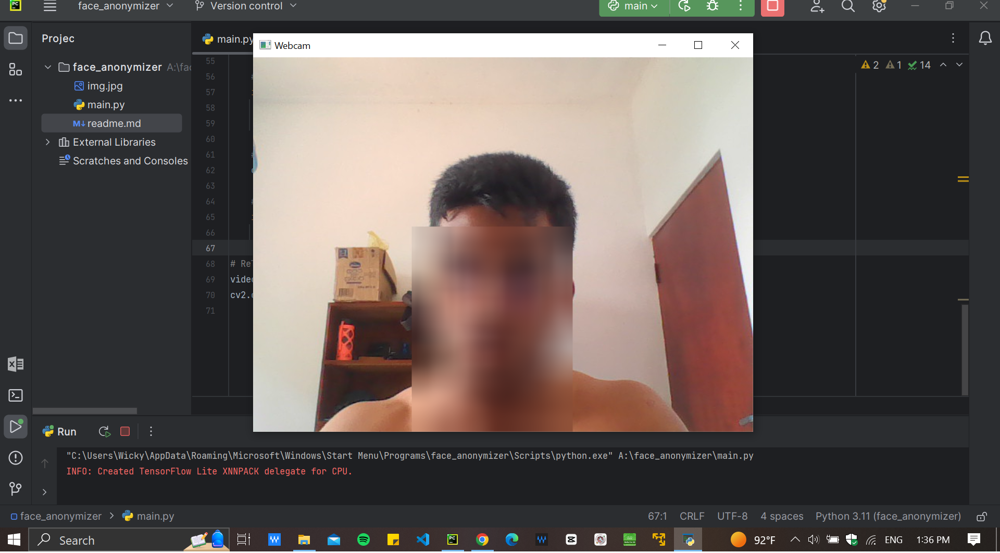

---

# Face Anonymizer with MediaPipe

This Python script uses MediaPipe and OpenCV to detect faces in a webcam stream and blur them in real-time. It utilizes the face detection capabilities of MediaPipe to locate faces in the video frames and then applies a blur effect to anonymize them. The blurred video stream is displayed using OpenCV.

## Dependencies

- OpenCV
- Mediapipe

You can install the dependencies using pip:

```bash
pip install opencv-python mediapipe
```

## Usage

1. Run the script `main.py`.
2. The webcam will start, and faces will be detected and anonymized in real-time.
3. Press 'q' to quit the application.

## Description

The script captures frames from the webcam and uses MediaPipe's face detection model to locate faces in the video stream. It then calculates the bounding box coordinates for each detected face and applies a blur effect to the corresponding region of interest (ROI) in the frame. The blurred frames are displayed in real-time using OpenCV.

## File Structure

- `main.py`: Main Python script for face anonymization.
- `img.jpg`: Sample image (unused in this script).
- `README.md`: This file.

## Example 
#### detection of face



## Note

Make sure to adjust the blur parameters and other settings as needed to achieve the desired anonymization effect. You can also modify the script to save the anonymized video stream to a file or integrate it into other applications as needed.

---

